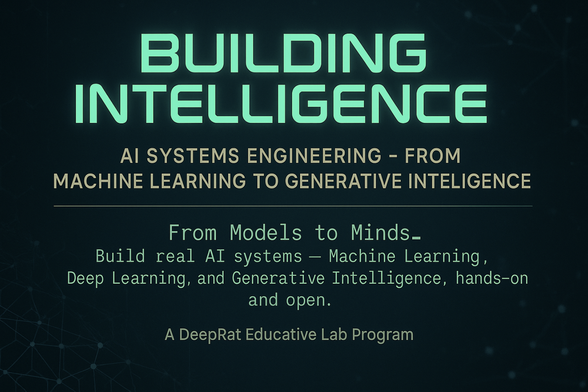

  
    

# 🧠 Building Intelligence

### _Ingeniería de Sistemas de IA: desde el Aprendizaje Automático hasta la Inteligencia Generativa_

_Un programa de DeepRat Educative Lab_

  
  
  
  
  

  <a href="#-sobre-el-programa">Sobre el Programa</a> •
  <a href="#-estructura">Estructura</a> •
  <a href="#-ruta-de-aprendizaje">Ruta de Aprendizaje</a> •
  <a href="SYLLABUS_ES.md">📘 Syllabus Completo</a> •
  <a href="QUICK_START-(EN\ES).md">🚀 Guía de Inicio Rápido</a>

---

## 🌍 Sobre el Programa

**Building Intelligence** es un **programa educativo abierto, estructurado y práctico** que te guía a lo largo de todo el recorrido de la **Inteligencia Artificial moderna** — desde el **Machine Learning tradicional** hasta los **Sistemas Generativos y Agentes de IA** más avanzados.

El proyecto está inspirado en el espíritu de la _educación abierta_.
Así como _Python para Todos_ una vez me abrió una puerta, este programa busca abrir esa misma puerta a cualquier persona con ganas de aprender y construir — sin suscripción, sin costo de GPU, sin barreras.

Todas las lecciones están desarrolladas en **Jupyter Notebooks**, diseñadas para **Google Colab (versión gratuita)** — compatibles con GPU cuando es necesario — y centradas en **sistemas de IA reales y reproducibles**.

¡Todas las lecciones están disponibles en inglés y español!
(Los archivos en Ingles se designan "\_EN" )

---

## 🚀 Estructura

El programa se divide en **15 módulos** organizados en **5 fases progresivas**, cada uno con varios **capítulos** que combinan contenido teórico y práctico.

**Ver el [📘 SYLLABUS completo](SYLLABUS_ES.md)** para información detallada de todos los módulos, objetivos de aprendizaje, proyectos y cronogramas sugeridos.

Cada capítulo incluye:

- `leccion_teorica.md` → teoría y fundamentos conceptuales
- `01_nombre.ipynb` → notebook interactivo principal
- `ejercicios.ipynb` → ejercicios prácticos
- `soluciones.ipynb` → soluciones guiadas
- `README.md` → objetivos de aprendizaje, prerequisitos y referencias

---

## 📅 Calendario de Publicaciones

Las lecciones se publican **semanalmente**, siguiendo un camino progresivo y continuo.

**Módulo actual:**
📘 _Enseñando a las máquinas a pensar — El enfoque en Python_
1️⃣ _Cómo aprenden las máquinas — El lenguaje de los datos_
2️⃣ _Trazando la primera línea — Predicción con Regresión Lineal Simple_

Próximas publicaciones:
🗓️ _Cada 7 días — nuevos capítulos y lecciones disponibles aquí._

---

## 🧩 Ruta de Aprendizaje

| Fase                                     | Enfoque                                               | Módulos |
| :--------------------------------------- | :---------------------------------------------------- | :------ |
| **1. Fundamentos de Machine Learning**   | Algoritmos básicos y aprendizaje supervisado          | 01–03   |
| **2. Deep Learning con PyTorch**         | Redes neuronales, TensorFlow, Keras, PyTorch          | 04–06   |
| **3. IA Generativa y LLMs**              | Transformers, fine-tuning y diseño de grandes modelos | 07–11   |
| **4. Agentes de IA y Sistemas RAG**      | RAG, LangChain, Agents y orquestación inteligente     | 12–15   |

**📘 [Ver SYLLABUS completo](SYLLABUS_ES.md)** para detalles de cada módulo, lecciones, proyectos y cronogramas.

---

## 🧰 Requisitos

- Python 3.10+
- Jupyter Notebook / Google Colab
- Librerías comunes de ML/IA: `numpy`, `pandas`, `scikit-learn`, `matplotlib`, `torch`, `tensorflow`, `transformers`, `langchain`, etc.
  _(La instalación se gestiona automáticamente en los notebooks de Colab.)_

---

## 💡 Objetivos

- Enseñar **ingeniería de IA** a través de proyectos reales y ejecutables.
- Ofrecer **acceso completamente abierto** a material estructurado y de alta calidad.
- Conectar la **teoría con la implementación práctica de sistemas**.
- Capacitar a autodidactas, estudiantes y profesionales para **construir sistemas reales**, no solo ejecutar demos.

---

## 📬 Conectá Conmigo

Seguí las actualizaciones, nuevos módulos y discusiones abiertas en:

- [🔗 Perfil de GitHub — DeepRatAI](https://github.com/DeepRatAI)
- [🤖 Hugging Face Spaces](https://huggingface.co/DeepRatAI)
- [💼 LinkedIn](https://www.linkedin.com/in/gonzalo-luis-romero-b9b5b4355)
- [🌐 Sitio Web — deeprat.tech](https://deeprat.tech)

---

## 🧠 Licencia

Todo el contenido educativo se publica bajo **Licencia MIT**.
Los notebooks, diagramas y ejemplos son libres para aprendizaje y adaptación — con atribución.

> _“De los modelos a las mentes — hagamos que la inteligencia vuelva a ser abierta.”_
> — Gonzalo Romero (_DeepRat_)
